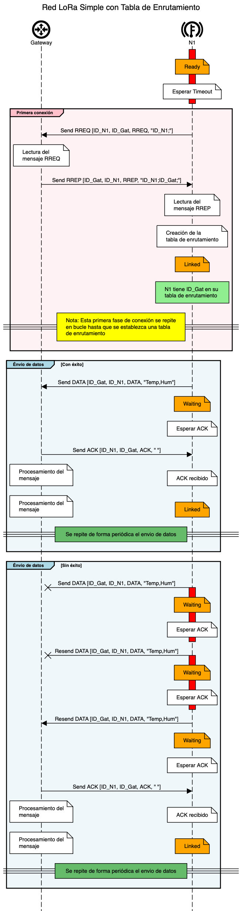

# LoRa_RoutingMesh_Nazaries [Rama master]
Código en VSCode - PlatformIO del nodo/gateway para el PFG de María Izuzquiza Fernandez
Curso académico 2023/2024

#### Nota: El código se esta implementado para que pueda ser usado tanto para Nodo como Gateway. Solo sería necesario modificar el archivo Platformio.ini para elegir el tipo.

### Platformio.ini
Uso de librerías y placas de desarrollo
### main.cpp
Programa general. Este programa incluye dos hilos. Se ejecutan en paralelo. 
- Hilo escucha (vTaskListen): este hilo es utilizado tanto por los nodos como por le gateway. Hilo encargado de estar leer el paquete enviado mediante LoRa.
- Hilo estados (vTaskStates): solo lo utilizan los nodos. Hilo encargado de hacer el cambio de estados. 
### Carpeta config 
Inicialización de los recursos de la placa de desarrollo y establecimiento de un ID único.
Recursos utilizados:
| Gateway  | Nodo |
| ------------- | ------------- |
| ID  | ID  |
| WiFI  | -  |
| LCD  | LCD  |
| LoRa  | LoRa  |
| -  | DHT11  |
### Carpeta http
Es la encargada del envío de mediciones al servidor.
Por cuestiones de confidencialidad con la empresa Nazraríes Intelligenia no se permite compartir esta información. 
### Carpeta package
Envio de paquete de datos y recepción del paquetes
Estructura de paquetes LoRa:
| ID propio (1 byte)  | ID destino (1 byte) | ID mensaje (1 byte)  | mensaje (variable) |
| ------------- | ------------- | ------------- | ------------- |
### Carpeta routing
Algoitmo de enrutamiento.
- Envío RREQ
- Envío RREP
- Generación de la tabla de enrutamiento y su actualización
- Análisis de la mejor ruta (para este caso solo se ha tenido en cuenta para una red simple)
### Carpeta secrets
Archivo de ejemplo para las creedenciales de la conexión WiFi
### Carpeta sensors
Sensor DHT11
### Carpeta states
Estados del sistemas (READY, LINKED, WAITING)
- READY: obtención de la tabla de enrutamiento en caso de que no este creada
- LINKED: envío periódico de medidas del sensor
- WAITING: estado de espera hasta recibir confirmación de recepción
### Carpeta timers
Temporizadores de envio y reenvio de paquetes. Para las pruebas realizadas los tiempos son los siguientes:
- Envio de paquetes cada 2 minutos
- Temporizador de reenvío: 1 min (no se recibie ACK (confirmación de recepción))
#### Nota: este tiempo es parametrizable.

## Diagrama de secuencial de la prueba realizada.

